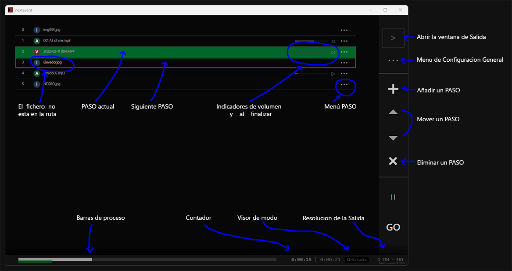
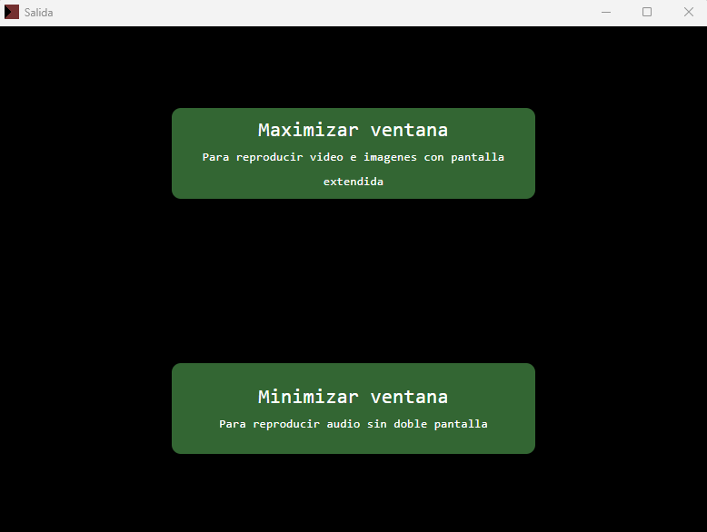
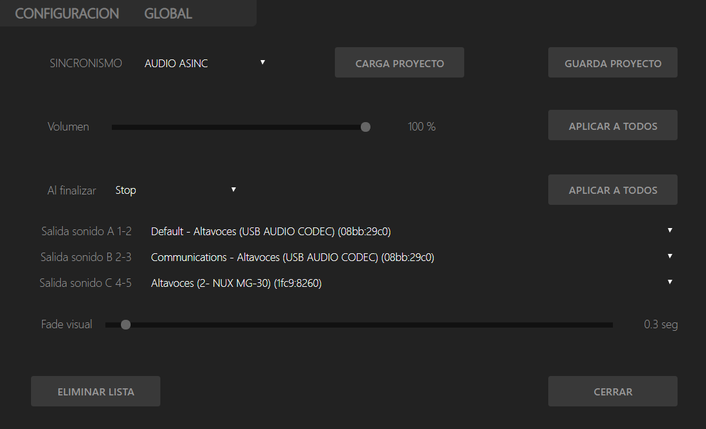
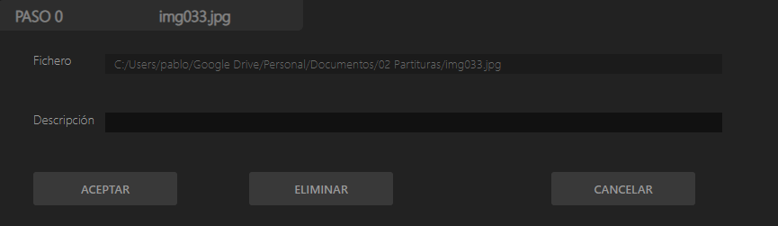
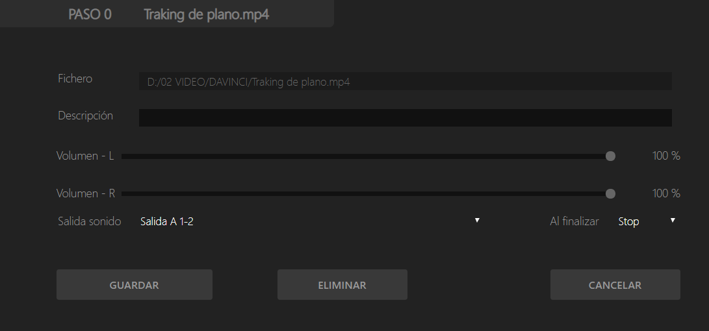

# n e x t e v e n t &nbsp;     8.0.0 

Aplicación de escritorio creada con   para  Windows, reproduce secuencias multimedia. 
## Instalación:
* Descargar el .zip en la pestaña `Code v`  `Download ZIP`.
* Descomprimir.
* Ejecutar de la carpeta `dist/` `nextevent Setup x.x.x.exe`.

  * Si no quereis instalarlo ejecútalo directamente en:
`dist/win-unpacked/nextevent.exe`
## Especificaciones:
* Puede reproducir cualquier fichero multimedia soportado por HTML5.
Control de volumen de cada paso.
Control acción cuando acaba un paso stop, siguiente o bucle.
Control general tiempo de desvanecimiento de los ficheros de imagen/video ` 0s > 10s `.
Dos modos de sincronía.
Guardado de proyectos en formato JSON. 

## Funcionamiento:
* ### Para  reproducir audio, video e imágenes: 
  * Ponemos el PC en modo pantalla extendida.
  * Hacemos click en el botón `[>]` para abrir la ventana de salida.
  * Arrastramos la ventana el escritorio extendido y hacemos click en ` Maximizar ventana `.

* ### Para reproducir solo audio:
  * Hacemos click en el botón `[>]` para abrir la ventana de salida.
  * Hacemos click en ` Minimizar ventana `.

## Modos de sincronismo:
* Se pueden elegir dos modos de funcionamiento:
* ### Modo SINCRONISMO : SINCRONO
  * En este modo todos los pasos se reproducen sincrónicamente.
  * Los pasos no se pueden solapar, cuando se pulsa GO el paso actual es eliminado y se muestra el siguiente.
* ### Modo SINCRONISMO : AUDIO ASINC
  * En este modo se crean dos flujos uno con imágenes y videos y otro solo con los audios.
Si se esta reproduciendo una imagen y el siguiente paso es un audio la imagen quedara en la salida 
mientras el sonido se reproduce, y no desaparecerá hasta que el siguiente paso sea una imagen o un video.
De igual manera el audio sonara asta terminar o hasta que el siguiente paso sea otro audio.

    * Si lo que se quiere hacer es terminar antes de tiempo un paso se pueden usar ficheros vacíos.

* ### Atajos de teclado
  * GO - Flecha derecha  ` ▷ ` o  `Enter`
  * PAUSE - Control derecho  `ControlRight`

***
## Pantalla de control:

***
## Pantalla de salida:

***
## Menu configuración Global:

***
## Menu configuración de un paso de imagen:

***
## Menu configuración de un paso de audio o video:

***
